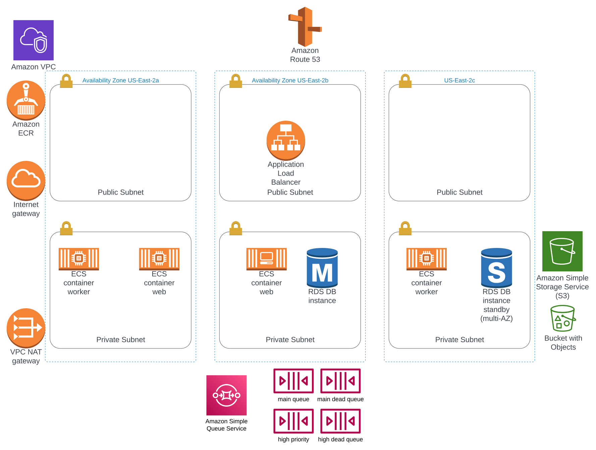

# Homelink
[](https://github.com/RichardOrnelas/homelink/actions/workflows/pull_request.yml)
[](https://github.com/RichardOrnelas/homelink/actions/workflows/pull_request_closed.yml)

[](https://github.com/RichardOrnelas/homelink/actions/workflows/main_merge.yml) [Sandbox Environment](https://sandbox.chainlink.deepseas.dev/)

[](https://github.com/RichardOrnelas/homelink/actions/workflows/prerelease.yml) [Staging Environment](https://staging.chainlink.deepseas.dev/)

[](https://github.com/RichardOrnelas/homelink/actions/workflows/release.yml) [Production Environment](https://chainlink.deepseas.dev/)

## Description
Homelink is a Ruby on Rails application that houses a simple user directory service. It allows users to create a profile, login to that profile, and update their profile, including a profile picture. It stores this data in a Postgres database, and leverages an Active Job processor to handle async operations using a queueing strategy.

## AWS Resources


I made an assumption that the service would live inside a current VPC, so it begins with the assumption that there is a VPC provided with some sort of tagging strategy. I built a new VPC for this project, but that is not a requirement. Simply need to update tagging in the infrastructure `.infrastructure/main.tf` to update the VPC.

Under the hood in AWS, Homelink leverages the following:
* AWS Elastic Container Service for Web and Worker container hosting.
* AWS Application Load Balancer for managing web connections
* AWS Relational Database Service for the PostGres db.
* AWS Simple Queue Service for high and low queues, and corresponding dead letter queues.
* AWS S3 bucket for storing attachments 

## Dependencies and Requirements
* terraform 1.4.6
* ruby 3.2.2
* postgres 15.2 
* nodejs 20.2.0
* AWS credentials for the sandbox environment. This repo is currently setup to reference your default credentials.
* See [setup](###-Setup) for local development setup


## Operating Environments
These operating environments are managed in the Terraform Workspaces.

- *sandbox* : For Developers to test deployments and integrations with the rest of the microservices with low risk and service level expectations.
- *staging* : Release candidates for integration and QA testing.
- *production* : You know what it is.

The current automation also provides a temporary operating environment for each non-draft Pull Request. Those environments are dynamically named based on the Pull Request ID.

## CI/CD Flow
1. New branch from `main`, ideally named from Github Issue like `#20/Do-the-thing` or with ownership like `Username/#20`
2. Make changes, creating a *draft* Pull Request for easy collaboration without triggering any Github Deployment Actions.
3. When you are ready to party, undraft. Automated workflows including testing, linting and validations will run and complete (hopefully).
4. Github Actions will deploy a temporary environment for your Pull Request. Subsequent updates to the Pull Request will be deployed to this infrastructure. That Github Action lives [here](.github/workflows/pull_request.yml).
5. After reviewing the code changes and the preview URL as needed, approve the code, and merge the Pull Request to `main`. 
6. With the Pull Request closed, the temporary Operating Environment is destroyed. Merge is not required for this operation. See the Action [here](.github/workflows/pull_request_closed.yml).
7. With the merge to `main` branch, the [**sandbox**](https://sandbox.chainlink.deepseas.dev) environment is updated. That Github Workflow lives [here](.github/workflows/main_merge.yml).
8. Whatever the reason, you create a new **Release** in Github with proper [semantic versioning](https://semver.org/),  and mark it as a `prerelease`. This deploys the [**staging**](https://staging.chainlink.deepseas.dev) environment.
9. QA efforts prove uneventful. Perfect. Sounds like Production o'clock. In Github, edit the release and uncheck the `prerelease` box and *Save*.
10. Apply sunscreen, unfold beach chair, and bask in orange glow of a new feature making it all the way to [**production**](https://chainlink.deepseas.dev)

## Rollback Procedures
# TODO: add
## Secrets and Configurations
This application leverages a few ways to manage configurations and secrets

- **SSM** - The ECS Task Definitions use SSM to pass the Database URL and S3 application bucket from the Terraform CI process.
- **.env.development** - This file holds the local configurations to launch the Rails app. These values are managed as environment variables in the AWS environments.
- **Github Project Secrets** - There are three secret values that are only used in the CI pipelines in github. They include AWS Credentials and a Slack Webhook URL.
- **.tfvars** - All non-sensitive configuration variables for the Terraform infrastructure are stored in these files.

## Setup Local Machine for Development
To setup your local developer environment, clone the repository to your local machine, and install these dependencies.

NOTE: To build and run the Docker image locally, you will need Docker installed.

- _Optional_ Install Homebrew
  ```
    /bin/bash -c "$(curl -fsSL https://raw.githubusercontent.com/Homebrew/install/HEAD/install.sh)"
    echo 'export PATH="/usr/local/sbin:$PATH"' >> ~/.zshrc
    source ~/.zshrc # If you see weird behavior, restart your terminal
    brew doctor
  ```
- Install `asdf`
  ```
  brew install coreutils curl git gpg gawk zsh yarn asdf
  echo -e "\n. $(brew --prefix asdf)/asdf.sh" >> ~/.zshrc
  echo 'legacy_version_file = yes' >> ~/.asdfrc
  ```
- Install `awscli`
  ```
  asdf plugin add awscli
  asdf install awscli latest
  asdf global awscli latest
  ```
- Install `terraform`
  ```
  asdf plugin add terraform
  asdf install terraform 1.4.6
  asdf global terraform 1.4.6
  ```
- Install `ruby` and `rails`
  ```
  asdf plugin add ruby
  asdf install ruby 3.2.2
  asdf global ruby 3.2.2
  gem install bundler rails
  ```
- Install `nodejs`
  ```
  asdf plugin add nodejs
  asdf install nodejs latest
  asdf global nodejs latest
  ```
- Install `postgresql`
  ```
  asdf plugin add postgres
  asdf install postgres 15.2
  asdf global postgres 15.2
  $HOME/.asdf/installs/postgres/15.2/bin/pg_ctl -D $HOME/.asdf/installs/postgres/15.2/data -l logfile start
  ```

## Working with Rails
Here are some tips for local development.

- Before you do anything, `bundle`
- To prepare the database, `rails db:setup`
- To drop the database and start fresh, `rails db:reset`
- To start the Rails server locally, `rails s`. This will be available at [localhost:8080](https://localhost:8080)
- To run the test suite, `bundle exec rspec`

## Working with Terraform
1. Change to the .infrastructure directory `cd .infrastructure`
2. Initialize Terraform `terraform init`
3. Make updates in the `main.tf` file, adding any variables to `variables.tf` and outputs to `outputs.tf`
4. Select the Sandbox Workspace `terraform workspace select sandbox`
5. Format the Terraform files `terraform fmt -check`
6. Validate configurations `terraform validate`
7. Plan to see proposed changes are what you expect `terraform plan -var-file="sandbox.tfvars"`

# Terraform Docs

<!-- BEGIN_TF_DOCS -->
## Requirements

| Name | Version |
|------|---------|
| <a name="requirement_terraform"></a> [terraform](#requirement\_terraform) | ~> 1.2 |
| <a name="requirement_aws"></a> [aws](#requirement\_aws) | ~> 4.0 |

## Providers

| Name | Version |
|------|---------|
| <a name="provider_aws"></a> [aws](#provider\_aws) | 4.67.0 |
| <a name="provider_random"></a> [random](#provider\_random) | 3.5.1 |

## Modules

No modules.

## Resources

| Name | Type |
|------|------|
| [aws_alb.web](https://registry.terraform.io/providers/hashicorp/aws/latest/docs/resources/alb) | resource |
| [aws_alb_listener.http](https://registry.terraform.io/providers/hashicorp/aws/latest/docs/resources/alb_listener) | resource |
| [aws_alb_listener.https](https://registry.terraform.io/providers/hashicorp/aws/latest/docs/resources/alb_listener) | resource |
| [aws_alb_target_group.http](https://registry.terraform.io/providers/hashicorp/aws/latest/docs/resources/alb_target_group) | resource |
| [aws_cloudwatch_log_group.web](https://registry.terraform.io/providers/hashicorp/aws/latest/docs/resources/cloudwatch_log_group) | resource |
| [aws_cloudwatch_log_group.worker](https://registry.terraform.io/providers/hashicorp/aws/latest/docs/resources/cloudwatch_log_group) | resource |
| [aws_db_instance.primary](https://registry.terraform.io/providers/hashicorp/aws/latest/docs/resources/db_instance) | resource |
| [aws_db_subnet_group.ecs](https://registry.terraform.io/providers/hashicorp/aws/latest/docs/resources/db_subnet_group) | resource |
| [aws_ecr_repository.homelink](https://registry.terraform.io/providers/hashicorp/aws/latest/docs/resources/ecr_repository) | resource |
| [aws_ecs_cluster.primary](https://registry.terraform.io/providers/hashicorp/aws/latest/docs/resources/ecs_cluster) | resource |
| [aws_ecs_cluster_capacity_providers.primary](https://registry.terraform.io/providers/hashicorp/aws/latest/docs/resources/ecs_cluster_capacity_providers) | resource |
| [aws_ecs_service.web](https://registry.terraform.io/providers/hashicorp/aws/latest/docs/resources/ecs_service) | resource |
| [aws_ecs_service.worker](https://registry.terraform.io/providers/hashicorp/aws/latest/docs/resources/ecs_service) | resource |
| [aws_ecs_task_definition.web](https://registry.terraform.io/providers/hashicorp/aws/latest/docs/resources/ecs_task_definition) | resource |
| [aws_ecs_task_definition.worker](https://registry.terraform.io/providers/hashicorp/aws/latest/docs/resources/ecs_task_definition) | resource |
| [aws_iam_role.ecs_execution](https://registry.terraform.io/providers/hashicorp/aws/latest/docs/resources/iam_role) | resource |
| [aws_iam_role.ecs_service](https://registry.terraform.io/providers/hashicorp/aws/latest/docs/resources/iam_role) | resource |
| [aws_iam_role.platform_service](https://registry.terraform.io/providers/hashicorp/aws/latest/docs/resources/iam_role) | resource |
| [aws_iam_role_policy.ecs_execution_policy](https://registry.terraform.io/providers/hashicorp/aws/latest/docs/resources/iam_role_policy) | resource |
| [aws_iam_role_policy.ecs_service](https://registry.terraform.io/providers/hashicorp/aws/latest/docs/resources/iam_role_policy) | resource |
| [aws_iam_role_policy.platform_service_policy](https://registry.terraform.io/providers/hashicorp/aws/latest/docs/resources/iam_role_policy) | resource |
| [aws_route53_record.www](https://registry.terraform.io/providers/hashicorp/aws/latest/docs/resources/route53_record) | resource |
| [aws_s3_bucket.bucket](https://registry.terraform.io/providers/hashicorp/aws/latest/docs/resources/s3_bucket) | resource |
| [aws_security_group.alb_public](https://registry.terraform.io/providers/hashicorp/aws/latest/docs/resources/security_group) | resource |
| [aws_security_group.ecs](https://registry.terraform.io/providers/hashicorp/aws/latest/docs/resources/security_group) | resource |
| [aws_security_group.rds](https://registry.terraform.io/providers/hashicorp/aws/latest/docs/resources/security_group) | resource |
| [aws_security_group_rule.alb_public_443_platform](https://registry.terraform.io/providers/hashicorp/aws/latest/docs/resources/security_group_rule) | resource |
| [aws_security_group_rule.alb_public_80_platform](https://registry.terraform.io/providers/hashicorp/aws/latest/docs/resources/security_group_rule) | resource |
| [aws_security_group_rule.ecs_self](https://registry.terraform.io/providers/hashicorp/aws/latest/docs/resources/security_group_rule) | resource |
| [aws_security_group_rule.ecs_sg_http](https://registry.terraform.io/providers/hashicorp/aws/latest/docs/resources/security_group_rule) | resource |
| [aws_security_group_rule.ecs_sg_http2](https://registry.terraform.io/providers/hashicorp/aws/latest/docs/resources/security_group_rule) | resource |
| [aws_security_group_rule.ecs_sg_https](https://registry.terraform.io/providers/hashicorp/aws/latest/docs/resources/security_group_rule) | resource |
| [aws_security_group_rule.egress](https://registry.terraform.io/providers/hashicorp/aws/latest/docs/resources/security_group_rule) | resource |
| [aws_security_group_rule.rds_postgres_ecs](https://registry.terraform.io/providers/hashicorp/aws/latest/docs/resources/security_group_rule) | resource |
| [aws_sqs_queue.queue](https://registry.terraform.io/providers/hashicorp/aws/latest/docs/resources/sqs_queue) | resource |
| [aws_sqs_queue.queue_dead](https://registry.terraform.io/providers/hashicorp/aws/latest/docs/resources/sqs_queue) | resource |
| [aws_sqs_queue_policy.queue](https://registry.terraform.io/providers/hashicorp/aws/latest/docs/resources/sqs_queue_policy) | resource |
| [aws_ssm_parameter.APP_BUCKET](https://registry.terraform.io/providers/hashicorp/aws/latest/docs/resources/ssm_parameter) | resource |
| [aws_ssm_parameter.DATABASE_URL](https://registry.terraform.io/providers/hashicorp/aws/latest/docs/resources/ssm_parameter) | resource |
| [random_password.rds_password](https://registry.terraform.io/providers/hashicorp/random/latest/docs/resources/password) | resource |
| [aws_acm_certificate.primary](https://registry.terraform.io/providers/hashicorp/aws/latest/docs/data-sources/acm_certificate) | data source |
| [aws_iam_policy_document.ecs_execution_grant](https://registry.terraform.io/providers/hashicorp/aws/latest/docs/data-sources/iam_policy_document) | data source |
| [aws_iam_policy_document.ecs_execution_policy](https://registry.terraform.io/providers/hashicorp/aws/latest/docs/data-sources/iam_policy_document) | data source |
| [aws_iam_policy_document.ecs_service_grant](https://registry.terraform.io/providers/hashicorp/aws/latest/docs/data-sources/iam_policy_document) | data source |
| [aws_iam_policy_document.ecs_service_policy](https://registry.terraform.io/providers/hashicorp/aws/latest/docs/data-sources/iam_policy_document) | data source |
| [aws_iam_policy_document.grant](https://registry.terraform.io/providers/hashicorp/aws/latest/docs/data-sources/iam_policy_document) | data source |
| [aws_iam_policy_document.platform_service](https://registry.terraform.io/providers/hashicorp/aws/latest/docs/data-sources/iam_policy_document) | data source |
| [aws_iam_policy_document.queue_policy](https://registry.terraform.io/providers/hashicorp/aws/latest/docs/data-sources/iam_policy_document) | data source |
| [aws_route53_zone.primary](https://registry.terraform.io/providers/hashicorp/aws/latest/docs/data-sources/route53_zone) | data source |
| [aws_subnets.private](https://registry.terraform.io/providers/hashicorp/aws/latest/docs/data-sources/subnets) | data source |
| [aws_subnets.public](https://registry.terraform.io/providers/hashicorp/aws/latest/docs/data-sources/subnets) | data source |
| [aws_vpc.primary](https://registry.terraform.io/providers/hashicorp/aws/latest/docs/data-sources/vpc) | data source |

## Inputs

| Name | Description | Type | Default | Required |
|------|-------------|------|---------|:--------:|
| <a name="input_db_instance_class"></a> [db\_instance\_class](#input\_db\_instance\_class) | Size and Class for the RDS Postgres instance | `string` | `"db.t3.micro"` | no |
| <a name="input_db_parameter_group"></a> [db\_parameter\_group](#input\_db\_parameter\_group) | Postgres database parameter group name | `string` | `"default.postgres15"` | no |
| <a name="input_db_postgres_version"></a> [db\_postgres\_version](#input\_db\_postgres\_version) | Postgres database version | `string` | `"15.3"` | no |
| <a name="input_docker_image"></a> [docker\_image](#input\_docker\_image) | Docker image to deploy | `string` | `"webdestroya/http-placeholder:latest"` | no |
| <a name="input_ip_whitelist"></a> [ip\_whitelist](#input\_ip\_whitelist) | IP Whitelist for non-production | `list(any)` | <pre>[<br>  "0.0.0.0/0"<br>]</pre> | no |
| <a name="input_project"></a> [project](#input\_project) | Name of the project | `string` | `"homelink"` | no |
| <a name="input_queues"></a> [queues](#input\_queues) | ## SQS ### | `list(string)` | <pre>[<br>  "main",<br>  "high"<br>]</pre> | no |
| <a name="input_region"></a> [region](#input\_region) | AWS Region to deploy resources in | `string` | `"us-east-1"` | no |
| <a name="input_web_count"></a> [web\_count](#input\_web\_count) | # of tasks running for web service | `number` | `1` | no |
| <a name="input_web_cpu"></a> [web\_cpu](#input\_web\_cpu) | CPU units for web task | `number` | `512` | no |
| <a name="input_web_mem"></a> [web\_mem](#input\_web\_mem) | Mem units for web task | `number` | `1024` | no |
| <a name="input_worker_count"></a> [worker\_count](#input\_worker\_count) | # of tasks running for worker service | `number` | `1` | no |
| <a name="input_worker_cpu"></a> [worker\_cpu](#input\_worker\_cpu) | CPU units for worker task | `number` | `512` | no |
| <a name="input_worker_mem"></a> [worker\_mem](#input\_worker\_mem) | Mem units for worker task | `number` | `1024` | no |

## Outputs

| Name | Description |
|------|-------------|
| <a name="output_app_bucket"></a> [app\_bucket](#output\_app\_bucket) | Application AWS S3 bucket name |
| <a name="output_db_arn"></a> [db\_arn](#output\_db\_arn) | RDS PostGres database ARN |
| <a name="output_db_endpoint"></a> [db\_endpoint](#output\_db\_endpoint) | RDS instance endpoint URL as postgres URL |
| <a name="output_ecs_cluster_name"></a> [ecs\_cluster\_name](#output\_ecs\_cluster\_name) | AWS ECS Cluster Name |
| <a name="output_private_subnets"></a> [private\_subnets](#output\_private\_subnets) | List of private subnets imported from the VPC |
| <a name="output_public_subnets"></a> [public\_subnets](#output\_public\_subnets) | List of public subnets imported from the VPC |
| <a name="output_sg_alb_public"></a> [sg\_alb\_public](#output\_sg\_alb\_public) | Security Group assigned to public-facing Application Load Balancers |
| <a name="output_sg_ecs"></a> [sg\_ecs](#output\_sg\_ecs) | Security Group assigned to ECS Services |
| <a name="output_sg_rds"></a> [sg\_rds](#output\_sg\_rds) | Security Group assigned to RDS instances |
| <a name="output_target_group_arn"></a> [target\_group\_arn](#output\_target\_group\_arn) | ARN for the Target Group belonging to the ECS Web Service |
| <a name="output_task_subnet"></a> [task\_subnet](#output\_task\_subnet) | Private AWS Subnet used for running database migration tasks |
| <a name="output_worker_task_def_arn"></a> [worker\_task\_def\_arn](#output\_worker\_task\_def\_arn) | ARN for the ECS Task Definition for the Worker service used to run database migration tasks |
| <a name="output_www_fqdn"></a> [www\_fqdn](#output\_www\_fqdn) | URL for the web application |
<!-- END_TF_DOCS -->
